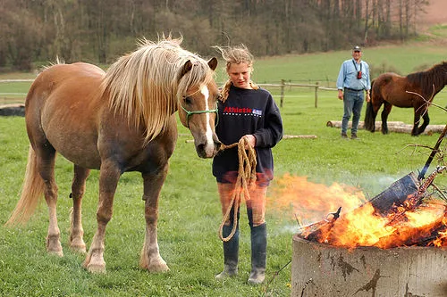
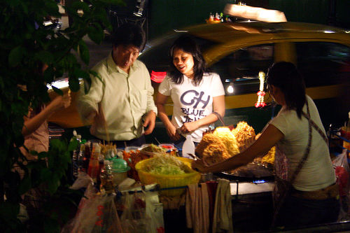
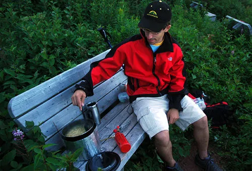

# Automatic Image Captioning

This project generates descriptive captions for images. A Convolutional Neural Network (CNN) reads the image and turns it into a feature vector, and a Recurrent Neural Network (LSTM) reads that vector and writes a sentence one word at a time.

Everything lives in one notebook, `AutomaticImageCaptioning.ipynb`, and there is a small Streamlit app for trying the trained model on your own images.

## Model Architecture

### Encoder

A ResNet50 pretrained on ImageNet, with its classification layer replaced by a linear layer that projects into the embedding space. How much of it trains is configurable:

- `none` keeps the backbone frozen and trains only the projection head
- `layer4` also trains the final residual block
- `all` trains the whole backbone

When any part of the backbone is unfrozen, its BatchNorm layers are held in inference mode. Those layers carry statistics estimated over ImageNet's 1.2 million images, and recomputing them from batches of 32 makes them noisy enough to undo the benefit of fine-tuning.

### Decoder

A single-layer LSTM with an embedding size of 256 and a hidden size of 512, with dropout of 0.5 before the output layer. The image feature is fed in as the first timestep, then `<SOS>`, then the words.

### Vocabulary

Built from the training split only, keeping words that appear at least 5 times. Special tokens are `<PAD>`, `<SOS>`, `<EOS>` and `<UNK>`.

## Dataset

[Flickr 8k](https://www.kaggle.com/datasets/adityajn105/flickr8k): 8,091 images with 5 captions each, so 40,455 caption rows in total.

The split is done on **images**, not on caption rows. Splitting rows would put four captions of an image into training and the fifth into validation, which means the model has already seen every image it is validated on. Splitting by image gives a genuinely held-out set, and each validation image keeps all five of its captions as BLEU references.

| | images | captions |
| --- | --- | --- |
| train | 6,473 | 32,365 |
| validation | 1,618 | 8,090 |

## Image Preprocessing

Images are decoded once and held in RAM as 256x256 uint8 tensors, about 1.6 GB for the whole dataset. Reading JPEGs off disk was taking 437 ms per batch against 21 ms of GPU work, so the GPU was idle roughly 95% of the time. Caching the decoded pixels fixes that while still allowing fresh random crops each epoch and still allowing the CNN to be fine-tuned, neither of which works if you cache the encoder's output instead.

| step | description |
| --- | --- |
| cache | decode once, resize to 256x256, keep in RAM as uint8 |
| training crop | random 224x224 crop plus random horizontal flip |
| validation crop | deterministic centre 224x224 crop |
| normalization | ImageNet mean `[0.485, 0.456, 0.406]`, std `[0.229, 0.224, 0.225]` |

## Training

| setting | value |
| --- | --- |
| epochs | 100, with early stopping after 15 epochs without improvement |
| batch size | 32 |
| optimizer | Adam |
| learning rate | 3e-4 for the decoder, 1e-5 for the CNN once unfrozen |
| scheduler | cosine annealing across the full run |
| gradient clipping | max norm 5.0 |
| loss | cross-entropy, ignoring `<PAD>` |

Fine-tuning happens in two stages. The decoder starts from random weights and produces large, uninformative gradients, so pushing those into a pretrained ResNet damages it before the decoder can benefit. The backbone stays frozen for the first 10 epochs and is unfrozen after that at a much lower learning rate.

## Evaluation

BLEU compares a generated caption against the real ones by counting matching word sequences. We report BLEU-1 through BLEU-4, using `corpus_bleu` with smoothing method 4.

Two things about how it is measured:

- Scores are pooled across the whole validation set with `corpus_bleu` rather than averaged over per-sentence scores. Averaging lets a two-word caption count as much as a twelve-word one, and published Flickr8k numbers use the pooled version, so this makes ours comparable to theirs.
- One caption is generated per image and compared against all five references at once, instead of generating the same caption five times and grading each against a single reference.

BLEU-1 through BLEU-4 all come from the same generated captions, so measuring all four costs nothing extra.

## Experiments

Each configuration changes exactly one thing against the baseline, so any difference in the results can be traced to that change.

| experiment | what changes |
| --- | --- |
| `baseline_frozen` | nothing, this is the reference point |
| `finetune_layer4` | unfreezes ResNet's final residual block after epoch 10 |
| `finetune_all` | unfreezes the whole backbone after epoch 10 |
| `larger_decoder` | LSTM hidden size 512 to 1024 |
| `no_augment` | centre crop only, no random crop or flip |

Beam width is not in this list because it only affects caption generation, never training. It is swept over the finished model instead, which costs a minute rather than a full run.

## Results

All scores are corpus BLEU on the 1,618 held-out validation images, at beam width 3.

| experiment | epochs run | best epoch | BLEU-1 | BLEU-2 | BLEU-3 | BLEU-4 | val loss |
| --- | --- | --- | --- | --- | --- | --- | --- |
| **finetune_layer4** | 32 | 17 | 0.6194 | 0.4402 | 0.3068 | **0.2133** | 2.7149 |
| finetune_all | 32 | 17 | 0.6191 | 0.4394 | 0.3052 | 0.2114 | 2.7100 |
| no_augment | 27 | 12 | 0.6149 | 0.4341 | 0.3014 | 0.2072 | 2.7524 |
| larger_decoder | 19 | 4 | 0.6152 | 0.4342 | 0.3011 | 0.2069 | 2.7851 |
| baseline_frozen | 23 | 8 | 0.6185 | 0.4383 | 0.3024 | 0.2065 | 2.7487 |

Three things came out of this:

- **Fine-tuning helps, but not by much.** Unfreezing `layer4` beat the frozen baseline by 0.0068 BLEU-4, about 3%. Flickr8k is everyday photos and ImageNet is too, so the pretrained features already fit; there was not much left to adapt. Unfreezing the whole backbone did slightly worse than unfreezing just `layer4`, which is what you would expect from 25M parameters and 6,473 images.
- **Decoder size is not the bottleneck.** Doubling the LSTM hidden size gave the worst validation loss of the five and peaked at epoch 4 before early stopping ended it at 19. More decoder capacity just overfits sooner.
- **Augmentation earned nothing here.** Turning off random crops and flips changed BLEU-4 by 0.0007, which is noise. That makes sense with a frozen CNN: only the small projection head ever sees the pixels.

Every run peaked between epochs 4 and 17 and early stopping ended all of them well before the 100 epoch limit. Overfitting is the binding constraint, not training time, which is why the future work below is about attention and more data rather than longer runs.

### Beam Width

Swept on the finished model, so this costs no retraining.

| beam width | BLEU-1 | BLEU-2 | BLEU-3 | BLEU-4 | mean length |
| --- | --- | --- | --- | --- | --- |
| 1 (greedy) | 0.5986 | 0.4179 | 0.2826 | 0.1920 | 10.43 |
| **3** | 0.6194 | 0.4402 | 0.3068 | **0.2133** | 9.72 |
| 5 | 0.6173 | 0.4383 | 0.3049 | 0.2118 | 9.35 |
| 7 | 0.6146 | 0.4366 | 0.3046 | 0.2117 | 9.05 |

Greedy decoding is clearly worse, and past width 3 the captions get shorter without getting better.

### Example Predictions

From `finetune_layer4`, at beam width 3.

| Image | Generated caption |
| --- | --- |
|  | a man and a woman are riding horses at a rodeo |
|  | a man and a woman are standing in front of a white building |
|  | a man in a red shirt is sitting on a bench |

These are a fair sample rather than the best three. The third one is basically right. The other two show the usual failure: the model gets the subject and the setting but invents the activity. Nobody is riding in the first image, a girl is leading a horse past a bonfire, and the second is a night food stall rather than a white building. It reaches for the most common phrasing that fits what it sees, which is exactly what a model with no attention mechanism would do, since it compresses the whole image into a single vector before writing a word.

Generated captions average 9.72 tokens against 10.83 for the references, so the model is writing full sentences rather than falling back on a few short safe ones.

### Before the Fix

For context, the earlier version of this project scored BLEU-4 of 0.0199. The loss had paired each decoder output with the token two places ahead instead of the next one, so the model was learning to skip a word. Training loss fell normally, which made it look healthy, but captions came out as "Man a on bike a" instead of "a man on a bike". The clue was BLEU sitting flat for ten epochs while the loss dropped 28%.

## Web Application

```bash
streamlit run app.py
```

Upload an image and the app generates a caption with the trained model.

## Project Structure

```
.
├── AutomaticImageCaptioning.ipynb   model, training, experiments, analysis
├── app.py                           Streamlit app for trying the model
├── models/
│   ├── best_image_captioning_model.pth   the exported winning model
│   └── training_history.json             per-epoch metrics for all five runs
└── image/                           images used in this README
```

The Flickr8k dataset is not in the repository. Download it from the link above and place it at `flickr8k/Images/` with `flickr8k/captions.txt`.

## Requirements

- Python 3.10+
- PyTorch and torchvision
- nltk
- streamlit
- numpy, pandas, matplotlib, pillow, tqdm

A CUDA GPU is strongly recommended. The runs above were done on an RTX 4080 SUPER.

## Team Members

- [Reema Al Jbreen](https://github.com/Rmsaah)
- [Madawee AlHathloul](https://github.com/madaweehath)

## Future Work

- Add an attention mechanism so the decoder can look at different parts of the image as it writes each word. This is also where a higher input resolution would start to pay off, since the current encoder averages the whole image into a single vector regardless of how many pixels go in.
- Try a Transformer decoder in place of the LSTM.
- Move to Flickr30k, which is about four times the data.

## Citation and Credits

Ghandi, V., Poovammal, E., & Aarthi, G. (2022). Deep Learning Approaches on Image Captioning. *2022 6th International Conference on Trends in Electronics and Informatics (ICOEI)*, 1076-1082. IEEE. https://doi.org/10.1109/ICOEI53556.2022.9777114

Vinod, S. (2019). A PyTorch Tutorial to Image Captioning (With Attention). GitHub. https://github.com/sgrvinod/a-PyTorch-Tutorial-to-Image-Captioning

The AI Epiphany (2022). Image Captioning with Attention - A PyTorch Tutorial Explained. https://www.youtube.com/watch?v=y2BaTt1fxJU
